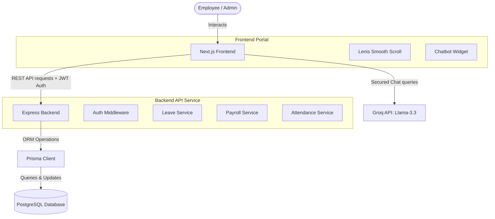

# WorkMesh - Unified HR & Operations Portal

WorkMesh is a premium, secure, and unified Human Resource Management & Operations platform designed for modern teams. It integrates shift punch consoles, daily attendance logs, regularization workflows, leave balance trackers, digital payroll slips, and document compliance vaults into a single cohesive system.

---

## 🏗️ Architecture & System Workflow

WorkMesh follows a decoupled architecture, joining a high-fidelity client portal with a secure, rate-limited REST API.



---

## 📂 Folder Structure

```text
WorkMesh/
├── frontend/                  # Next.js Frontend Application
│   ├── app/
│   │   ├── api/
│   │   │   └── chat/          # Groq Cloud API Proxy Endpoint
│   │   ├── components/        # UI View Components
│   │   │   ├── ChatbotWidget  # Floating Round AI Chatbot Widget
│   │   │   ├── LenisProvider  # Smooth Scroll Manager
│   │   │   ├── landing-page   # Landing Page
│   │   │   ├── dashboard-view # Main Employee Console
│   │   │   └── auth-views     # Login & Registration Forms
│   │   ├── globals.css        # Global CSS with Neobrutalism theme
│   │   └── layout.tsx         # Root Layout
│   └── package.json           # Frontend package configurations
├── prisma/                    # Database Migrations & Seeds
│   ├── schema.prisma          # Database Entity Schema
│   └── seed.ts                # Database Seeder file
├── src/                       # Express Backend Application
│   ├── modules/               # Domain-specific backend modules
│   │   ├── attendance/        # Attendance Logs & Regularizations
│   │   ├── auth/              # JWT Auth & Password Recovery
│   │   ├── leave/             # Leave Requests & Accrual Balances
│   │   └── payroll/           # Payroll Processing & Payslip downloads
│   ├── middlewares/           # Auth Guards & Security Headers
│   ├── server.ts              # Express Server entrypoint
│   └── app.ts                 # Express Configurations
├── package.json               # Backend package configurations
└── README.md                  # Project Documentation
```

---

## 🚀 Setup & Execution Guide

Follow these steps to set up and run both services locally.

### Prerequisites
* **Node.js**: v18.0.0 or higher
* **PostgreSQL Database**: Running locally or hosted on Render/RDS

### 1. Database Setup
Copy `.env.example` to `.env` in the root folder, customize the connection string, and run migrations:
```bash
# Configure DATABASE_URL in .env
npx prisma migrate dev --name init
npx prisma db seed
```

### 2. Run Backend Server
From the project root directory:
```bash
# Install dependencies
npm install

# Start Express backend (Running on port 5001)
npm run dev
```

### 3. Run Frontend Portal
From the `frontend` directory:
```bash
cd frontend

# Create .env.local and add GROQ_API key
echo "GROQ_API=your_groq_key_here" > .env.local

# Install dependencies
npm install

# Start Next.js frontend (Running on http://localhost:3000)
npm run dev
```

---

## 🛡️ Core Security Implementations

* **JWT Token Family Rotation**: Automated token lifecycle checks block unauthorized administrative transactions.
* **Path Traversal Mitigation**: File controllers strictly validate file pathways to protect systems from directory traversal vulnerabilities.
* **Dynamic AI Scope Guardrails**: The Groq API endpoint enforces a strict system prompt restricting Llama 3.3 to answer product-specific and HR platform queries only, politely refusing off-topic requests.
